# Project: Search and Sample Returns (write-up) #


The goal of this project is to automatically drive a rover to map an area in a simulation.

The rover is equipped with a camera and other motion sensors. With the images gathered from the camera, we do the following steps to each image:

1. Perspective transform: In this step, we convert the perspective view from the rover into a bird-eye view.
2. Color thresholding: We use simple color thresholding to identify road, obstacles (including walls), and rocks.
3. Coordinate transformations: Convert Rover coordinates into world coordinates so we may stich the views into a complete map. We also convert the navigable terrain into polar coordinates that we can use in the rover's navigation.

Read the next section for the locations in the code where I applied the above steps.

## Notebook Analysis ##

Each step above was first run in the Notebook to ensure it is working properly. In this section, I present the results with both a test image provided by Udacity and a recorded image I took from the simulator.

### Original image

Test image:

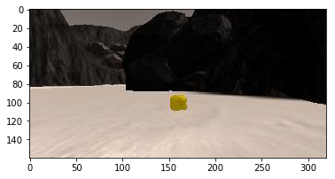

Recorded image:

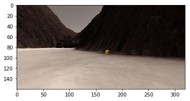

### Perspective Transform

With test image:

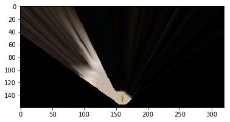

With recorded image:

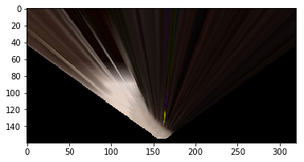

#### Changes in `process_image()` function

Define calibration box in source (actual) and destination (desired) coordinates. These source and destination points are defined to warp the image to a grid where each 10x10 pixel square represents 1 square meter. 

The destination box will be 2\*dst_size on each side.

And then, set a bottom offset to account for the fact that the bottom of the image is not the position of the rover but a bit in front of it.

Refer to the following code block in `process_image()` function:

```
    # 1) Define source and destination points for perspective transform
    dst_size = 5 
    bottom_offset = 6
    source = np.float32([[14, 140], [301 ,140],[200, 96], [118, 96]])
    destination = np.float32([[image.shape[1]/2 - dst_size, image.shape[0] - bottom_offset],
                      [image.shape[1]/2 + dst_size, image.shape[0] - bottom_offset],
                      [image.shape[1]/2 + dst_size, image.shape[0] - 2*dst_size - bottom_offset], 
                      [image.shape[1]/2 - dst_size, image.shape[0] - 2*dst_size - bottom_offset],
                      ])

    # 2) Apply perspective transform
    warped = perspect_transform(img, source, destination)
```


### Color Thresholding

With test image:

Road:

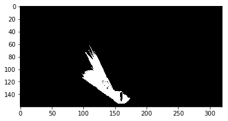

Rock:


Obstacle:

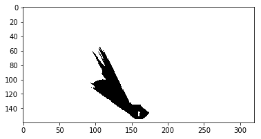

With recorded image:

Road:

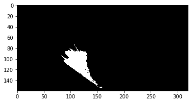

Rock:

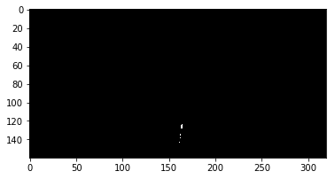

Obstacle:

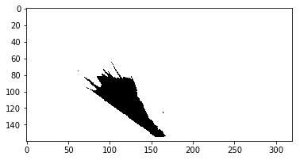

We were able to identify the navigable terrain, rock, and obstacle area correctly.

#### Changes in `process_image()` function

To threshold the rock, I use a range thresholding between R: 110, G: 110, B: 5 and R: 255, G: 255, and B: 90. That range collects the gold color properly.

For the road and obstacle, I used R: 160, G: 160, and B:160. The system identifies anything above those values as road and below those values as obstacles.

Refer to the following code block in `process_image()` function:

```
    # 3) Apply color threshold to identify navigable terrain/obstacles/rock samples
    road = color_thresh(warped, rgb_thresh=(160, 160, 160))
    rock = color_thresh_range(warped, rgb_thresh_min=(110,110, 5), rgb_thresh_max=(255, 255, 90))
    obst = color_thresh((-1 * warped), rgb_thresh=(-160, -160, -160))

```

### Coordinate Transformations

With test image:

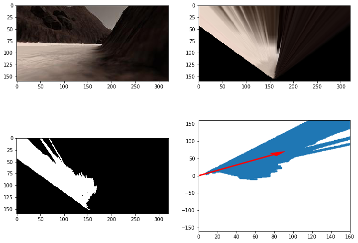

With recorded image:

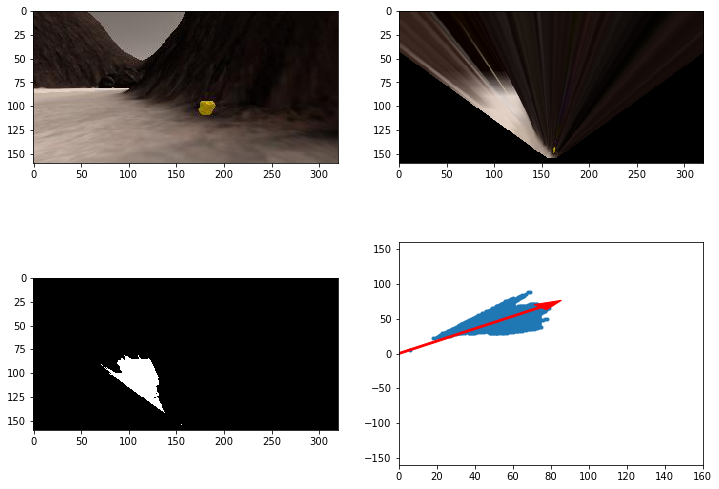

The arrow shows a mean direction of the area of interest. In this case, it points to the area where most navigable terrain (road) lies. We use this direction in our rover automatic navigation module.

#### Changes in `process_image()` function

I converted the image pixels to rover-centric coordinates and then to world coordinates and updated the worldmap for obstacles, road, and rock.

Refer to the following code block in `process_image()` function:

```
    # 4) Convert thresholded image pixel values to rover-centric coords
    x_road, y_road = rover_coords(road)
    x_rock, y_rock = rover_coords(rock)
    x_obst, y_obst = rover_coords(obst)

    # 5) Convert rover-centric pixel values to world coords
    wx_road, wy_road = pix_to_world(x_road, y_road, xpos, ypos, yaw, data.worldmap.shape[0], 10)
    wx_rock, wy_rock = pix_to_world(x_rock, y_rock, xpos, ypos, yaw, data.worldmap.shape[0], 10)
    wx_obst, wy_obst = pix_to_world(x_obst, y_obst, xpos, ypos, yaw, data.worldmap.shape[0], 10)

    # 6) Update worldmap (to be displayed on right side of screen)
    data.worldmap[wy_obst, wx_obst, 0] += 1
    data.worldmap[wy_rock, wx_rock, 1] += 1
    data.worldmap[wy_road, wx_road, 2] += 1
```

The final step of `process_image()` is just presenting the worldmap, as described below:

```
    # 7) Make a mosaic image, below is some example code
        # First create a blank image (can be whatever shape you like)
    output_image = np.zeros((img.shape[0] + data.worldmap.shape[0], img.shape[1]*2, 3))
        # Next you can populate regions of the image with various output
        # Here I'm putting the original image in the upper left hand corner
    output_image[0:img.shape[0], 0:img.shape[1]] = img

        # Let's create more images to add to the mosaic, first a warped image
    warped = perspect_transform(img, source, destination)
        # Add the warped image in the upper right hand corner
    output_image[0:img.shape[0], img.shape[1]:] = warped

        # Overlay worldmap with ground truth map
    map_add = cv2.addWeighted(data.worldmap, 1, data.ground_truth, 0.5, 0)
        # Flip map overlay so y-axis points upward and add to output_image 
    output_image[img.shape[0]:, 0:data.worldmap.shape[1]] = np.flipud(map_add)
```


## Test Run with a video ##

I stiched together results of running `process_image()` with all images I have recorded, then output it into a video. The video is located at `/output/test_mapping.mp4`.

## Autonomous Navigation and Mapping ##

I included the code I have written in the `process_image()` function from the notebook into the `perception_step()` function at the bottom of `perception.py` script.

Udacity has provided a scaffolding code in `decision.py` that allows some basic logic for the rover to explore the area and turn around when faced with a dead-end.

### Improve tendency to explore

The default code has the tendency to explore the same road over and over. I improved the tendency to explore new locations by jpdating the code in `Rover.mode == 'forward'`: Add the mean steering by a random number between 0 and -10. This means the rover will be more likely to pick the right road, but if it was somehow stuck in a circle, it can also pick a different road by random chance.

### Stuck recovery

In addition to Udacity's scaffold code for `decision.py`, In this code, I also added a simple logic to recover from being stuck:

1. Detect the velocity of the rover for the last 20 frames.
2. If the mean velocity is between -0.01 and 0.01, we determine that the rover is stuck.
3. When the rover is stuck, throttle backward until either:
 - The rover reaches a velocity of -0.9 or lower.
 - The rover has been going in reverse for 100 frames.
4. Then reset the `stuck_counter` limit to 100 and initiate "forward" mode. This means the rover will move forward for at least 100 frames before it can think that it is "stuck" again.

### Optimize for fidelity

The initial code had a hard time reaching the required fidelity > 60%. The fidelity kept decreasing over time. I updated the perception code to only update the rover's worldmap when its roll and pitch values are between -1.0 and 1.0.

## Screenshot of the result
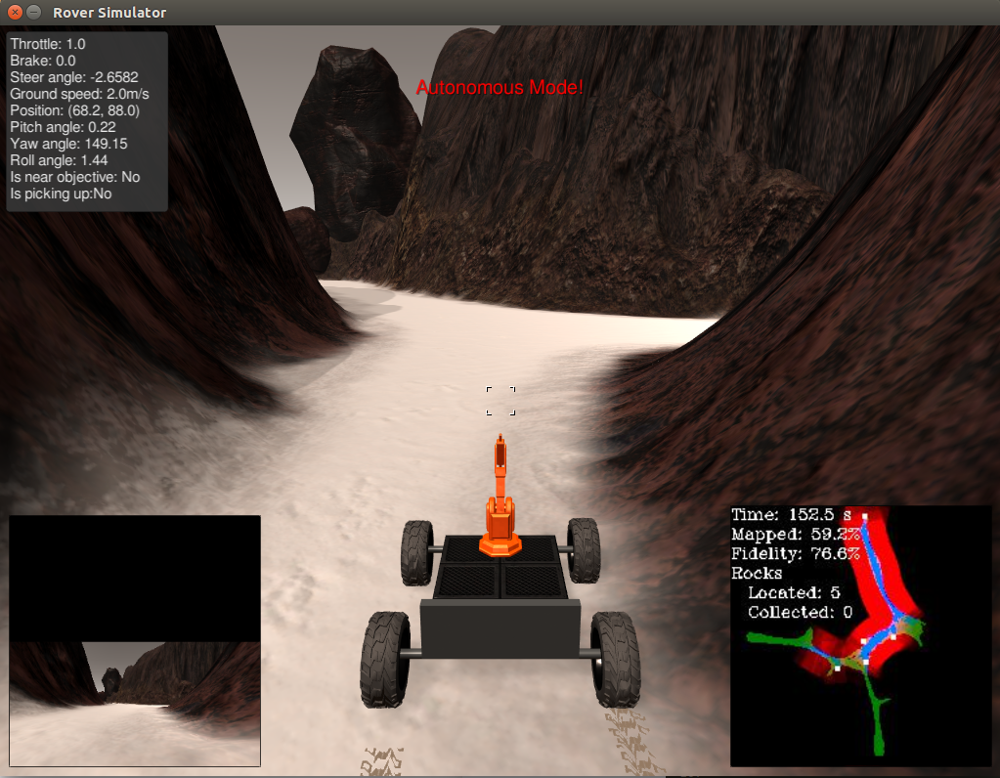
